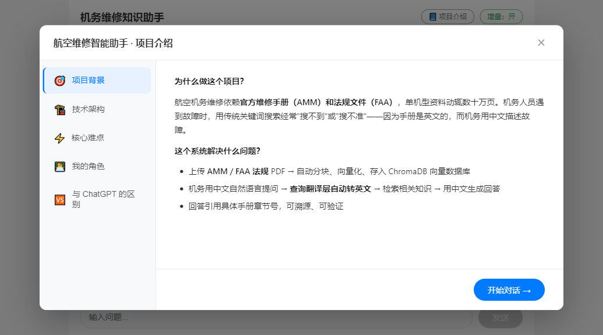
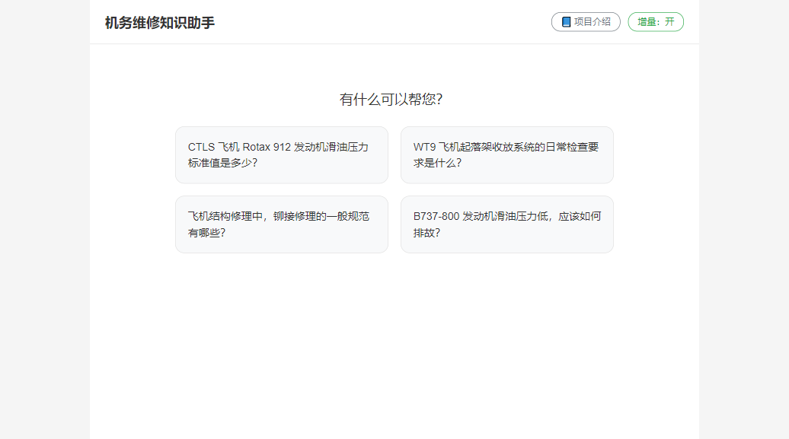
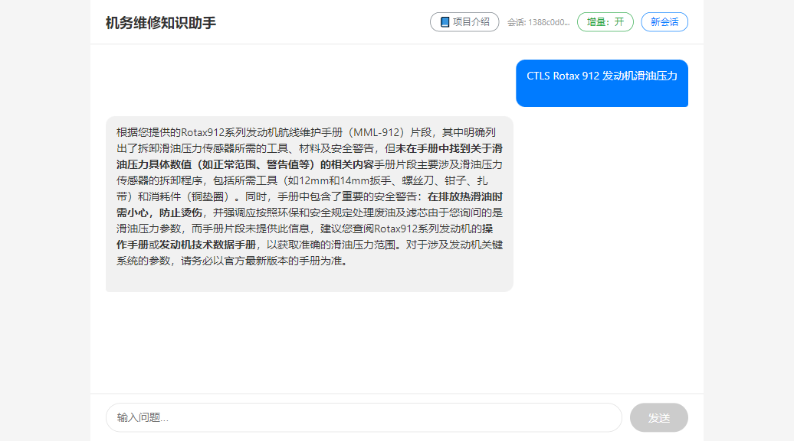
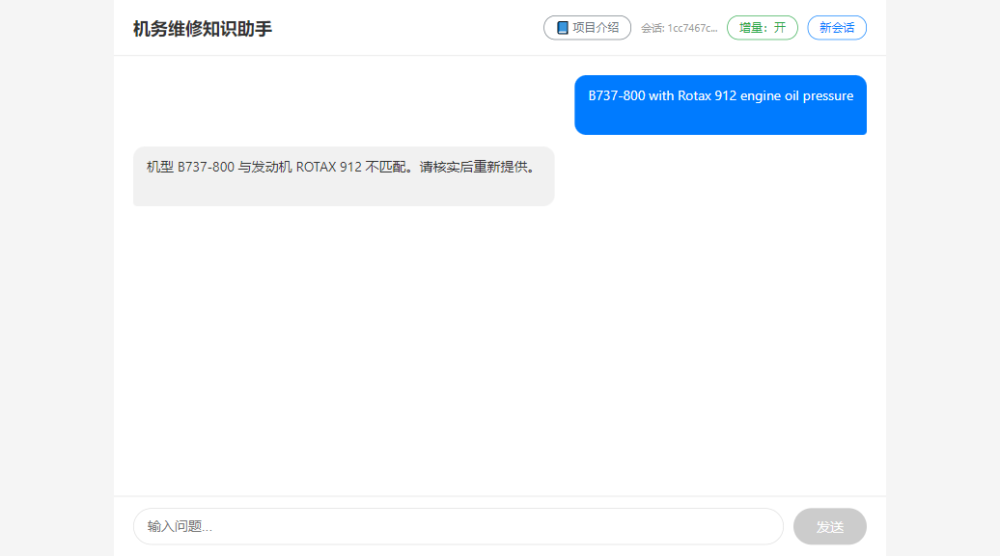
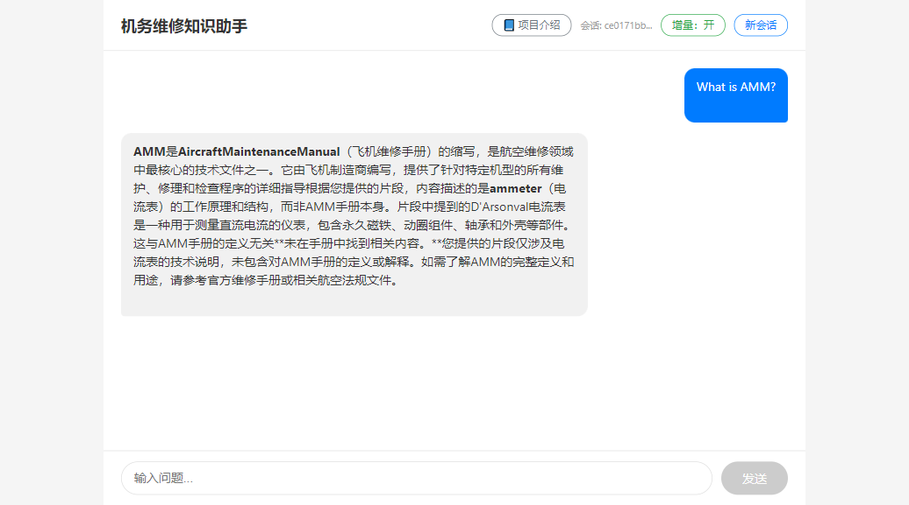
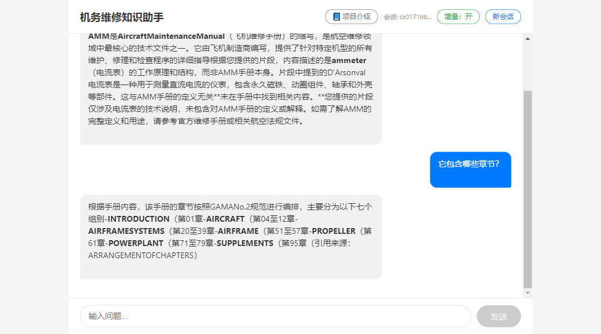
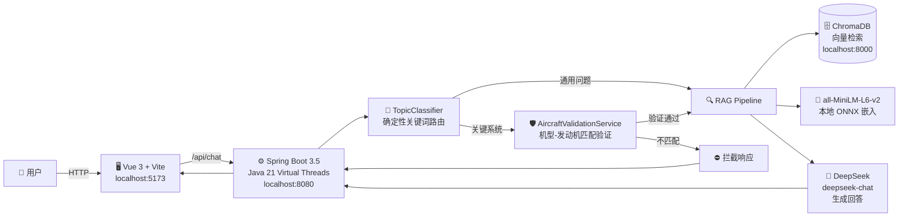

# ✈️ 机务维修知识助手（Aviation Maintenance Assistant）

> 基于 **RAG + Agent** 技术的航空维修知识库智能问答系统。
> 由一位拥有 4 年深航机务维修经验的工程师设计，解决维修手册查询效率低、易查错机型、易断章取义的痛点。

[](https://spring.io/projects/spring-boot)
[](https://adoptium.net/)
[](https://vuejs.org/)
[](https://github.com/langchain4j/langchain4j)
[](https://www.deepseek.com/)
[](https://www.trychroma.com/)
[](LICENSE)

---

## 📸 功能演示

### 项目介绍模式

首次进入自动弹出项目导览，方便非航空背景面试官快速理解项目背景、技术架构与核心难点。



### 初始界面

空对话状态下，页面中央展示 4 个快捷体验气泡，覆盖发动机、起落架、结构修理、航线排故四类典型场景，点击即可一键发送问题。



### 场景一：正确机型匹配 + RAG 检索

输入机型与发动机型号，系统自动验证匹配关系，检索维修手册并生成带引用来源的回答。



### 场景二：机型-发动机不匹配拦截

当用户输入不匹配的机型组合时，**确定性代码层直接拦截**，不走 LLM，避免幻觉风险。



### 场景三：通用知识问答

非关键系统问题直接走 RAG 检索，回答包含手册原文引用。



### 场景四：多轮追问（会话续聊）

已验证会话支持 `conversationId` 续聊，自动注入机型上下文，无需重复提供机型信息。



> 💡 **完整交互 GIF**（录制中）：从输入问题到获取带引用回答的完整流程。

---

## 🚀 核心特性

| 特性 | 说明 |
|------|------|
| 🔍 **RAG 检索增强** | 基于 AMM 维修手册、FAA 法规等公开资料，检索相关片段后由 DeepSeek 生成回答，并标注来源 |
| 🤖 **Agent 机型验证** | 对话前强制校验飞机型号与发动机型号匹配，不匹配即拦截 |
| 🛡️ **确定性路由** | 发动机/飞控/起落架等关键系统走硬性代码路由，**不走 LLM 自路由**，杜绝概率性错误 |
| 💬 **会话管理** | 内存会话存储，支持 `conversationId` 多轮续聊，已验证机型自动注入上下文 |
| ⚡ **Java 21 虚拟线程** | 基于 Virtual Threads 实现高并发 IO 密集型服务，阻塞成本趋近于零 |
| 🧠 **纯本地嵌入模型** | all-MiniLM-L6-v2 本地 ONNX 推理，零外部 Embedding API 依赖，20MB 轻量 |
| 🛡️ **多层限流保护** | Bucket4j 令牌桶限流，默认 20 次/小时/IP；全局 DeepSeek 调用 500 次/天上限，防止 Token 被恶意刷光 |
| 🔄 **优雅降级** | DeepSeek 异常时返回固定友好提示，避免前端空白或暴露内部错误 |
| 🐳 **Docker 一键部署** | `docker compose up -d` 启动前端 + 后端 + ChromaDB |
| 📘 **项目介绍模式** | 首次进入自动弹出项目导览，方便非航空背景面试官快速理解项目价值 |

---

## 🏗️ 技术架构



### 请求生命周期（以"CTLS 发动机滑油压力"为例）

1. **用户输入** → `POST /api/chat` → 后端接收 `ChatRequest`
2. **路由分类** → `TopicClassifier` 识别"发动机"关键词 → 判定为关键系统
3. **信息提取** → `AircraftInfoExtractor` 从 query 中提取机型（CTLS）和发动机（Rotax 912）
4. **机型验证** → `AircraftValidationService` 查询硬编码匹配表 → **MATCH**
5. **会话管理** → 生成 `conversationId`，保存验证状态到 `ChatSessionStore`
6. **RAG 检索** → `TranslationQueryTransformer` 优化查询 → ChromaDB 向量检索 → 取 Top-5 片段
7. **LLM 生成** → 将检索片段注入 Prompt → DeepSeek 生成带引用的回答
8. **响应返回** → `ChatResponse`（reply + conversationId）→ 前端渲染

---

## ⚡ 快速开始

### 前置条件

- [Docker](https://www.docker.com/products/docker-desktop/)（用于 ChromaDB）
- JDK 21（[Eclipse Temurin](https://adoptium.net/temurin/releases/?version=21)）
- [Node.js 20+](https://nodejs.org/)（前端开发）
- DeepSeek API Key（[获取地址](https://platform.deepseek.com/)）

### 方式一：Docker Compose 一键启动（推荐）

```bash
# 1. Clone 仓库
git clone https://github.com/fejerome/aviation-maintenance-assistant.git
cd aviation-maintenance-assistant

# 2. 配置环境变量
cp .env.example .env
# 编辑 .env，填入你的 DEEPSEEK_API_KEY

# 3. 一键启动（前端 + 后端 + ChromaDB）
docker compose up -d
```

访问前端：**http://localhost**

后端 API：**http://localhost:8080/api/chat**

详细部署文档见 [DEPLOY.md](DEPLOY.md)。

### 方式二：手动启动（开发调试）

```bash
# 1. 启动 ChromaDB
docker run -d --name chromadb -p 8000:8000 \
  -v ./backend/chroma-data:/chroma/chroma \
  chromadb/chroma:0.5.5

# 2. 启动后端（⚠️ 必须从 backend/ 目录内启动）
cd backend
export DEEPSEEK_API_KEY="sk-xxxxxxxx"
./mvnw spring-boot:run

# 3. 启动前端
cd ../frontend
npm install
npm run dev
```

访问前端：**http://localhost:5173**

后端 API：**http://localhost:8080/api/chat**

> 📄 详细部署文档见 [DEPLOY.md](DEPLOY.md)。

---

## 📁 项目结构

```
.
├── backend/                 # Spring Boot 后端
│   ├── src/main/java/.../   # Java 源码
│   │   ├── chat/            # 聊天 API、路由、服务、会话
│   │   ├── document/        # PDF 文档摄入
│   │   ├── rag/             # RAG 组件（查询翻译器等）
│   │   ├── validation/      # 机型验证服务
│   │   └── config/          # LLM / ChromaDB 配置
│   ├── data/                # PDF 源文档（gitignore）
│   ├── chroma-data/         # ChromaDB 持久化数据（gitignore）
│   └── pom.xml
├── frontend/                # Vue 3 前端
│   ├── src/
│   │   ├── App.vue          # 聊天主界面
│   │   └── components/      # 聊天消息组件
│   ├── Dockerfile           # 前端 Nginx 镜像
│   ├── nginx.conf           # 前端 Nginx 反向代理配置
│   └── package.json
├── docs/                    # 项目文档
│   ├── API.md               # 接口文档
│   ├── ARCHITECTURE.md      # 架构说明
│   ├── ADR/                 # 架构决策记录
│   └── design/              # 功能设计文档
├── docker-compose.yml       # Docker Compose 编排
├── DEPLOY.md                # 部署指南
├── LICENSE                  # MIT 许可证
├── scripts/                 # 测试与工具脚本
│   └── tests/               # 手动/半自动验收脚本
│       ├── integration/     # 后端集成测试
│       ├── e2e/             # 端到端测试
│       └── docker/          # Docker 部署验证
└── README.md                # 本文件
```

---

## 📚 数据来源

本项目仅使用**公开、合法、无版权风险**的航空维修资料：

| 资料 | 类型 | 用途 |
|------|------|------|
| [FAA AC 65-9A](https://www.faa.gov/documentLibrary/media/Advisory_Circular/AC_65-9A.pdf) | 美国政府公开教材 | 机务基础知识库 |
| [Flight Design CTLS AMM](http://flightdesignusa.com/support/resources) | 轻型飞机公开维修手册 | 具体维护程序演示 |
| [Rotax 912 Line Maintenance](https://brp-rotax.com/) | 发动机维护手册 | 发动机系统演示 |

> ⚠️ **严禁使用**波音/空客商用飞机的 AMM（受版权保护，需航空公司订阅）。

---

## 🔗 在线演示

🌐 **https://ama.pandazi.cn**（即将上线）

> 当前阶段建议本地运行体验完整功能。部署到云服务器后更新此链接。

---

## 📖 相关文档

- [API 文档](docs/API.md) — 后端接口请求/响应示例
- [架构说明](docs/ARCHITECTURE.md) — 模块职责与数据流详解
- [架构决策记录](docs/ADR/) — 为什么选 LangChain4j、ChromaDB、DeepSeek
- [部署指南](DEPLOY.md) — Docker Compose 部署与环境变量说明
- [开发规范](docs/CONTRIBUTING.md) — 文档驱动开发流程与 Commit 规范

---

## 📝 License

本项目基于 [MIT License](LICENSE) 开源。

---

> **项目定位**：Java + AI 交叉方向的求职作品，结合 4 年深航机务维修经验，构建垂类领域 Agent。
>
> 如果你也是航空维修从业者或对 Java AI 应用感兴趣，欢迎 Star ⭐ 和交流！
