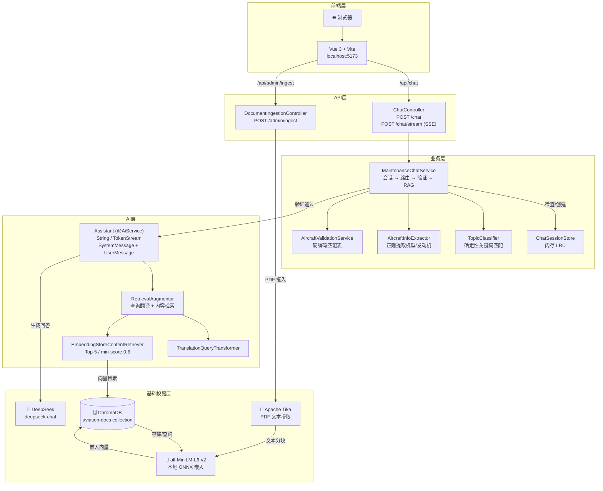

# 架构说明（ARCHITECTURE.md）

> 本文档面向技术面试官和后续开发者，帮助你在 3 分钟内理解系统全貌。

---

## 目录

- [技术栈总览](#技术栈总览)
- [前后端目录结构](#前后端目录结构)
- [系统架构图](#系统架构图)
- [核心模块职责](#核心模块职责)
- [请求生命周期详解](#请求生命周期详解)
- [技术约束与边界](#技术约束与边界)

---

## 技术栈总览

| 层级 | 技术 | 版本 | 选型理由 |
|------|------|------|---------|
| **运行时** | Eclipse Temurin JDK | 21 LTS | 虚拟线程支持，零商业许可风险 |
| **后端框架** | Spring Boot | 3.5.14 | 成熟稳定，LangChain4j 兼容性验证通过 |
| **AI 框架** | LangChain4j | 1.14.1 | Java 生态最成熟的 LLM 应用框架，原生支持 `TokenStream` 流式抽象（详见 [ADR-001](ADR/ADR-001-langchain4j-over-spring-ai.md)） |
| **LLM** | DeepSeek | deepseek-chat | 英文能力强、成本低、国内稳定，支持 OpenAI 兼容的 `stream: true` 协议（详见 [ADR-003](ADR/ADR-003-deepseek-over-dashscope.md)） |
| **流式传输** | Spring SseEmitter | Spring Boot 内置 | 标准 SSE 协议，浏览器原生 `EventSource` 支持（详见 [ADR-004](ADR/ADR-004-streaming-output-over-blocking.md)） |
| **向量数据库** | ChromaDB | 0.5.5（Docker） | 轻量持久化，本地与云环境零差异（详见 [ADR-002](ADR/ADR-002-chromadb-over-others.md)） |
| **嵌入模型** | all-MiniLM-L6-v2 | 本地 ONNX | 20MB 轻量，纯 Java 推理，零外部依赖 |
| **PDF 解析** | Apache Tika | 随 LangChain4j | 支持多种文档格式，与 LangChain4j 文档解析器集成 |
| **前端框架** | Vue 3 | 3.5.35 | 响应式系统，Composition API，Vite 快速冷启动 |
| **构建工具** | Vite | 5.4.0 | 开发服务器代理 `/api` 到后端，解决 CORS |
| **部署** | Docker + Docker Compose | 最新 | 一键编排 ChromaDB + 后端 |

---

## 前后端目录结构

```
aviation-maintenance-assistant/
├── backend/                              # Spring Boot 后端
│   ├── src/main/java/cn/pandazi/...
│   │   ├── AviationMaintenanceAssistantApplication.java
│   │   ├── config/                       # Spring 配置层
│   │   │   ├── OpenAiConfig.java         # DeepSeek LLM Bean 配置
│   │   │   └── RagConfig.java            # ChromaDB + Embedding + RetrievalAugmentor 配置
│   │   ├── chat/                         # 聊天核心模块
│   │   │   ├── api/
│   │   │   │   └── ChatController.java   # POST /chat REST 入口
│   │   │   ├── dto/
│   │   │   │   ├── ChatRequest.java      # { message, conversationId }
│   │   │   │   └── ChatResponse.java     # { reply, conversationId }
│   │   │   ├── routing/
│   │   │   │   ├── AircraftInfoExtractor.java   # 从 query 提取机型/发动机（正则）
│   │   │   │   └── TopicClassifier.java         # 关键词路由：关键系统 vs 通用知识
│   │   │   ├── service/
│   │   │   │   ├── Assistant.java        # LangChain4j @AiService 声明式接口
│   │   │   │   └── MaintenanceChatService.java  # 聊天路由层核心（会话→路由→验证→RAG）
│   │   │   └── session/
│   │   │       ├── ChatSessionStore.java # 内存 LRU 会话存储（ConcurrentHashMap）
│   │   │       └── SessionContext.java   # 会话上下文：机型、发动机、验证状态
│   │   ├── document/                     # 文档摄入模块
│   │   │   ├── api/
│   │   │   │   └── DocumentIngestionController.java  # POST /admin/ingest
│   │   │   └── service/
│   │   │       └── DocumentIngestionService.java     # PDF 解析 → 分块 → 嵌入 → 存储
│   │   ├── rag/                          # RAG 增强组件
│   │   │   └── TranslationQueryTransformer.java      # 查询翻译/优化器（如英译中）
│   │   └── validation/                   # 机型验证模块
│   │       ├── dto/
│   │       │   └── ValidationResult.java # MATCH / MISMATCH / UNKNOWN
│   │       └── service/
│   │           └── AircraftValidationService.java    # 硬编码机型-发动机匹配表
│   ├── src/main/resources/
│   │   └── application.yaml              # 主配置文件
│   ├── data/                             # PDF 源文档（gitignore）
│   ├── chroma-data/                      # ChromaDB 持久化数据（gitignore）
│   ├── Dockerfile                        # 多阶段构建：maven 编译 → jre 运行
│   └── pom.xml                           # Maven 依赖管理
│
├── frontend/                             # Vue 3 前端
│   ├── src/
│   │   ├── main.js                       # Vue 应用入口
│   │   ├── App.vue                       # 聊天主界面（输入框 + 消息列表 + 会话管理）
│   │   ├── components/
│   │   │   └── ChatMessage.vue           # 单条消息渲染（用户/系统角色区分）
│   │   └── style.css                     # 全局样式
│   ├── index.html
│   ├── package.json
│   └── vite.config.js                    # Vite 配置：端口 5173，代理 /api → localhost:8080
│
├── docs/                                 # 项目文档
│   ├── API.md                            # 接口文档
│   ├── ARCHITECTURE.md                   # 本文件
│   ├── ADR/                              # 架构决策记录
│   └── test-reports/                     # 测试报告与截图
│
├── docker-compose.yml                    # Docker Compose 编排（ChromaDB + 后端）
├── DEPLOY.md                             # 部署指南
└── README.md                             # 项目总览
```

---

## 系统架构图



---

## 核心模块职责

### 后端模块

| 模块 | 关键类 | 职责 | 设计原则 |
|------|--------|------|---------|
| **Config** | `OpenAiConfig`, `RagConfig` | 声明 LLM、EmbeddingModel、EmbeddingStore、ContentRetriever、RetrievalAugmentor 等 Bean | Spring IoC 统一装配，RAG 组件通过 `@Lazy` 延迟初始化 |
| **Chat API** | `ChatController` | REST 入口：非流式 `POST /chat` 返回 `ChatResponse`；流式 `POST /chat/stream` 返回 `SseEmitter` | 薄控制器，无业务逻辑，协议转换层 |
| **Chat DTO** | `ChatRequest`, `ChatResponse` | 请求/响应数据契约 | Java `record`，不可变 |
| **Routing** | `TopicClassifier` | 确定性关键词匹配（发动机/滑油/飞控等），判断是否需要机型信息 | **不走 LLM**，封闭域覆盖率 100% |
| **Routing** | `AircraftInfoExtractor` | 从用户 query 中正则提取机型和发动机型号，支持厂商前缀剥离、子型号识别 | 纯文本处理，零外部调用 |
| **Chat Service** | `MaintenanceChatService` | 核心 orchestrator：查会话 → 路由分类 → 提取验证 → RAG/阻断。流式场景下注册 `TokenStream` 回调，将 token 推入 `SseEmitter` | 所有控制流决策均为确定性代码，不感知流式/非流式的实现差异 |
| **Chat Service** | `Assistant` | LangChain4j `@AiService` 声明式接口。非流式返回 `String`；流式返回 `TokenStream`。自动拼接 SystemMessage + 检索片段 + UserMessage | 框架自动生成实现类，开发者只写接口。返回类型决定内部调用 `ChatLanguageModel` 还是 `StreamingChatLanguageModel` |
| **Session** | `ChatSessionStore` | 基于 `ConcurrentHashMap` 的内存 LRU 会话存储 | 演示版零部署依赖，生产版可替换为 Redis |
| **Session** | `SessionContext` | 会话状态：confirmedModel、confirmedEngine、validated | 验证通过后锁定机型上下文 |
| **Document** | `DocumentIngestionController` | 触发 PDF 批量摄入 | 管理接口，演示版无鉴权 |
| **Document** | `DocumentIngestionService` | PDF → Tika 解析 → 文本分块 → 嵌入 → ChromaDB 存储 | LangChain4j 文档处理流水线 |
| **RAG** | `TranslationQueryTransformer` | 在检索前优化/翻译用户查询，提升召回率 | 可选启用，通过 `application.yaml` 配置 |
| **Validation** | `AircraftValidationService` | 硬编码 `Map<String, List<String>>` 机型-发动机匹配表 | 验证是硬性准入条件，**不是 @Tool**，不能由 LLM 决定是否执行 |

### 前端模块

| 模块 | 关键文件 | 职责 |
|------|---------|------|
| **入口** | `main.js` | 创建 Vue 应用实例，挂载到 DOM |
| **主界面** | `App.vue` | 聊天容器：消息列表、输入框、会话 ID 展示、新会话按钮 |
| **消息组件** | `ChatMessage.vue` | 单条消息渲染，区分用户（user）和系统（system）角色样式 |
| **配置** | `vite.config.js` | 开发服务器端口 5173，代理 `/api` 到 `http://localhost:8080` |

---

## 请求生命周期详解

以用户输入 **"CTLS的Rotax 912发动机滑油压力标准"** 为例，走通完整链路：

### ① 前端发送请求

```javascript
fetch('/api/chat', {
  method: 'POST',
  headers: { 'Content-Type': 'application/json' },
  body: JSON.stringify({
    message: "CTLS的Rotax 912发动机滑油压力标准",
    conversationId: null  // 首次请求，无会话
  })
})
```

### ② 后端接收请求（ChatController）

```java
@PostMapping
public ChatResponse chat(@RequestBody ChatRequest request) {
    return chatService.process(request.conversationId(), request.message());
}
```

### ③ 会话初始化（MaintenanceChatService）

- `conversationId` 为空 → 生成新 UUID：`a1b2c3d4-...`
- 查 `ChatSessionStore` → 未命中（新会话）

### ④ 路由分类（TopicClassifier）

- 用户问题包含"发动机"和"滑油"关键词
- `needsAircraftInfo()` 返回 `true` → **关键系统，必须验证机型**

### ⑤ 信息提取（AircraftInfoExtractor）

- 从 query 中提取：
  - 机型：`CTLS`
  - 发动机：`Rotax 912`
- 提取结果完整（`isComplete() == true`）

### ⑥ 机型验证（AircraftValidationService）

- 查询硬编码匹配表：`CTLS` → 支持的发动机列表包含 `Rotax 912`
- 返回 `ValidationResult.MATCH`

### ⑦ 会话状态保存

- 创建 `SessionContext(CTLS, Rotax 912, validated=true)`
- 存入 `ChatSessionStore`：`sessionStore.put("a1b2c3d4-...", context)`

### ⑧ 机型上下文注入

```java
String contextualMessage = "[当前机型：CTLS，发动机：Rotax 912] CTLS的Rotax 912发动机滑油压力标准";
```

### ⑨ RAG 检索（RetrievalAugmentor）

- **查询翻译**（可选）：`TranslationQueryTransformer` 优化查询
- **向量检索**：`EmbeddingStoreContentRetriever` 将查询嵌入为向量 → ChromaDB 相似性搜索
  - 配置：`maxResults=5`，`minScore=0.6`
  - 返回 Top-5 相关手册片段

### ⑩ LLM 生成（Assistant / DeepSeek）

- LangChain4j 自动拼接 Prompt：
  ```
  System: 你是一个专业的航空维修知识助手...
  User: [当前机型：CTLS，发动机：Rotax 912] CTLS的Rotax 912发动机滑油压力标准
  
  <相关手册片段 1>...
  <相关手册片段 2>...
  ...
  ```
- DeepSeek 生成带引用来源的回答

### ⑪ 响应返回

```json
{
  "reply": "根据提供的维修手册片段，未找到CTLS机型Rotax 912发动机滑油压力的具体标准值...",
  "conversationId": "a1b2c3d4-e5f6-7890-abcd-ef1234567890"
}
```

### ⑫ 前端渲染

- 顶部显示会话 ID（前 8 位）
- 消息列表追加系统回复
- 输入框清空并重新聚焦

---

## 流式请求生命周期详解

以用户输入 **"CTLS的Rotax 912发动机滑油压力标准"** 为例，走通 **流式** 链路（`POST /chat/stream`）：

### ①~⑨ 与非流式完全一致

会话初始化 → 路由分类 → 信息提取 → 机型验证 → 会话保存 → 机型上下文注入 → RAG 检索，所有步骤与非流式模式完全相同。

### ⑩ LLM 流式生成（Assistant / TokenStream / DeepSeek）

- `Assistant.chat()` 返回类型为 `TokenStream`（而非 `String`）
- LangChain4j `AiServices` 代理自动识别返回类型，内部调用 `StreamingChatLanguageModel`
- HTTP 请求体增加 `stream: true`，DeepSeek 返回 `text/event-stream`
- `MaintenanceChatService` 注册回调：
  ```java
  tokenStream
      .onNext(token -> emitter.send(SseEmitter.event().name("token").data(token)))
      .onComplete(response -> emitter.send(SseEmitter.event().name("complete").data(json)))
      .onError(error -> emitter.send(SseEmitter.event().name("error").data(errorMessage)))
      .start();
  ```

### ⑪ SSE 逐字推送

```
event: token
data: 根据

event: token
data: 您

event: token
data: 提供
...

event: complete
data: {"conversationId":"a1b2c3d4-e5f6-7890-abcd-ef1234567890"}
```

### ⑫ 前端逐字渲染

- 前端通过 `EventSource` 接收 `token` 事件，每收到一个 token 立即追加到当前消息末尾
- 用户感知到"打字机效果"，首字延迟从秒级降至毫秒级
- 收到 `complete` 事件后保存 `conversationId`，关闭连接

---

## 技术约束与边界

### 当前实现的已知限制（演示版）

| 限制 | 说明 | 演进路径 |
|------|------|---------|
| **会话存储** | 内存 `ConcurrentHashMap`，应用重启丢失 | 生产环境替换为 Redis + TTL |
| **机型匹配表** | 硬编码 3～5 组常见机型-发动机，非 exhaustive | 接入航空数据库 API 或维护后台管理 |
| **单实例部署** | 无负载均衡、无水平扩展 | 云部署时配合 Nginx + 多容器 |
| **同会话机型切换** | 已验证会话不会重新验证新机型 | 增加"重新提取并验证"逻辑 |
| **PDF 摄入** | 需手动触发 `/admin/ingest` | 增加定时任务或文件监听自动摄入 |
| **无用户鉴权** | 所有接口公开访问 | 增加 JWT/API Key 鉴权层 |
| **流式错误处理** | SSE 中途出错时，前端需通过 `event: error` 感知，不能像非流式那样直接读 HTTP 状态码 | 统一 SSE 错误事件格式，前端增加错误事件监听器 |

### 非功能性设计约束

| 约束 | 实现方式 |
|------|---------|
| **高并发** | Java 21 Virtual Threads，IO 阻塞不占用平台线程 |
| **零外部 Embedding 依赖** | all-MiniLM-L6-v2 本地 ONNX 推理，20MB |
| **确定性控制流** | 路由/验证层纯代码硬逻辑，不走 LLM 自路由 |
| **回答可追溯** | RAG 回答强制标注手册引用来源，不编造 |
| **安全拦截** | 机型不匹配直接阻断，不调用 LLM，避免幻觉风险 |

---

*最后更新：2026-06-07（新增流式请求生命周期、TokenStream 架构标注）*
